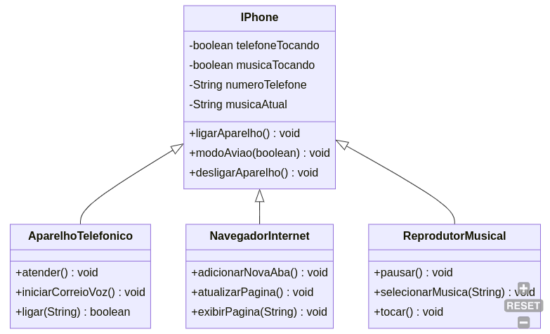

# Exercício de Introdução ao Java

## Conteúdo

Exercício básico de modelagem UML apresentado ao curso Spring Java da [DIO](https://dio.me). O diagrama UML foi criado usando [Mermaid Editor](https://mermaid.live).

## Descrição

Este código demonstra a modelagem UML (*Unified Modelling Language*).
